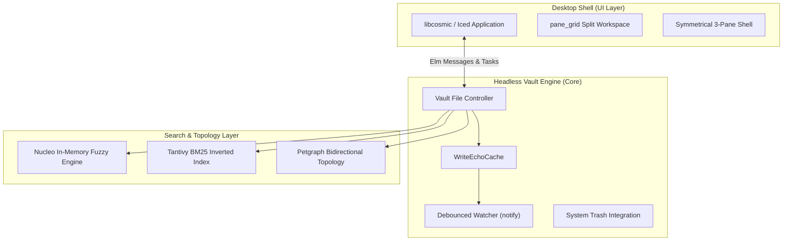

# COSMIC Notes

<div align="center">


-purple?style=for-the-badge)


**A native, high-performance, local-first Markdown notes app built for System76's COSMIC Desktop Environment on Pop!_OS.**

[Features](#-features) • [Architecture](#-architecture) • [Getting Started](#-getting-started) • [Quality Assurance](#-quality-assurance) • [Roadmap](#-roadmap)

</div>

---

## 🌟 Philosophy & Mission

COSMIC Notes is designed around a single uncompromising principle: **Local-First, File-over-App**.

Your notes belong to you. They are standard CommonMark / GitHub Flavored Markdown (`.md`) files stored in a regular filesystem directory on your machine. There are no proprietary database blobs, no vendor lock-in, and full interoperability with tools like Obsidian, VS Code, and Git.

COSMIC Notes pairs this open-file philosophy with the visual elegance and speed of System76's next-generation **COSMIC Desktop Environment**.

---

## ✨ Features

- ⚡ **Native COSMIC Experience**: Built with [`libcosmic`](https://github.com/pop-os/libcosmic) using The Elm Architecture (TEA) and GPU-accelerated rendering. Harmonizes directly with system accents, light/dark themes, and COSMIC HIG.
- 📐 **Symmetrical 3-Pane Navigation**:
  - **Explorer Column (Left, 260px)**: Fast note browsing, folder counts, and clickable `#tag` filtering.
  - **Distraction-Free Canvas (Center)**: Borderless text editor with seamless writing surface and zero outline rings.
  - **Inspector Column (Right, 260px)**: Real-time telemetry (word count, reading time), tag badges, and bidirectional link topology.
- 🪟 **Resizable Split Workspace (`pane_grid`)**:
  - **Edit Mode**: Focused typing canvas.
  - **Split Mode**: Resizable side-by-side editing and live Markdown preview with synchronized cursor-driven scrolling.
  - **Preview Mode**: Clean, full-canvas reading view.
- 🔍 **Dual-Tier Sub-Millisecond Search**:
  - **Microsecond Fuzzy Matcher**: Powered by [`nucleo`](https://github.com/helix-editor/nucleo) for $<0.1\text{ ms}$ search across titles, paths, and tags.
  - **Tantivy BM25 Full-Text Index**: Disk-persisted inverted index with field boosting and keyword snippet highlighting in $<0.5\text{ ms}$.
- 🕸️ **Bidirectional Knowledge Graph**:
  - Author with `[[wikilinks]]`.
  - Automatic incoming backlink detection and outgoing link resolution powered by [`petgraph`](https://github.com/petgraph/petgraph).
  - Visual indicators for resolved notes and uncreated ghost notes (`⤑`).
- 🛡️ **Reliability & Safety**:
  - **Write-Echo Cancellation**: Thread-safe `WriteEchoCache` with atomic tokens prevents filesystem watcher loops during auto-saves.
  - **Safe Deletion**: Deleting notes safely moves files to the system trash bin using the [`trash`](https://crates.io/crates/trash) crate (no unrecoverable deletions).

---

## 🏗️ Architecture



---

## 🚀 Getting Started

### Prerequisites

- **Rust**: Version 1.85+ (2024 Edition support).
- **System Dependencies** (Pop!_OS / Ubuntu):
  ```bash
  sudo apt install -y build-essential libxkbcommon-dev libwayland-dev pkg-config
  ```

### Build & Run

1. Clone the repository:
   ```bash
   git clone https://github.com/cavalcantevitor/cosmic-notes.git
   cd cosmic-notes
   ```

2. Run the application:
   ```bash
   cargo run --release
   ```

3. Run the automated test suite:
   ```bash
   cargo test --lib --tests
   ```

---

## 🧪 Quality Assurance

COSMIC Notes undergoes continuous **Design QA** and Quality of Life (QoL) audits based on industry-standard UI/UX methodologies:
- Evaluated against [Business of Apps QA Framework](https://www.businessofapps.com/insights/the-role-of-quality-assurance-in-ui-ux-design/) and [AppLighter Mobile/Desktop Testing Pillars](https://www.applighter.com/blog/app-quality-assurance).
- Comprehensive audit report available in [`QOL_REPORT.md`](QOL_REPORT.md).
- Strict Conventional Commits v1.0.0 git standards maintained across all branches.

---

## 🗺️ Roadmap

- [x] **Phase 1**: Headless Vault Engine, atomic saving, write-echo cancellation, safe trash deletion.
- [x] **Phase 2**: Dual-Tier Search (Nucleo + Tantivy) and Bidirectional Knowledge Graph (`petgraph`).
- [x] **Phase 3**: Native COSMIC Shell, symmetrical 3-pane layout, docked note inspector.
- [x] **Phase 4**: Resizable `pane_grid` split workspace and synchronized scrolling.
- [ ] **Phase 5**: Global Quick Switcher palette (`Ctrl+P`) and Full-Text Search overlay (`Ctrl+Shift+F`).
- [ ] **Phase 6**: Future-Proof Contracts: Pure-Rust Git Sync (`gix`) and Model Context Protocol (MCP) AI Assistant tool integration.

---

## 📄 License

Licensed under the **GNU General Public License v3.0 or later** ([GPL-3.0-or-later](LICENSE)).
